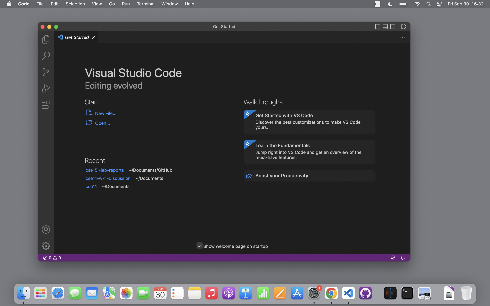
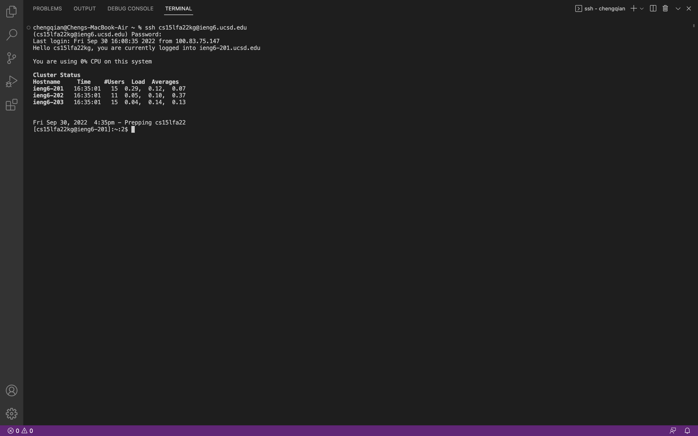
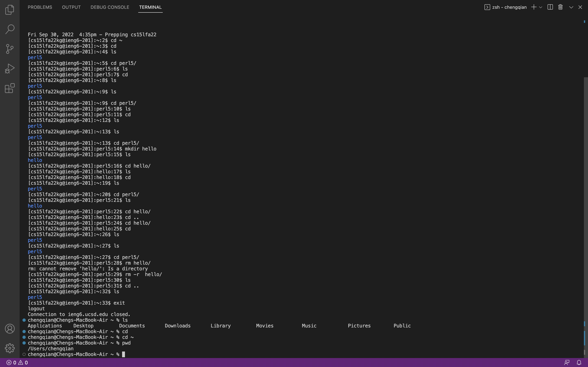
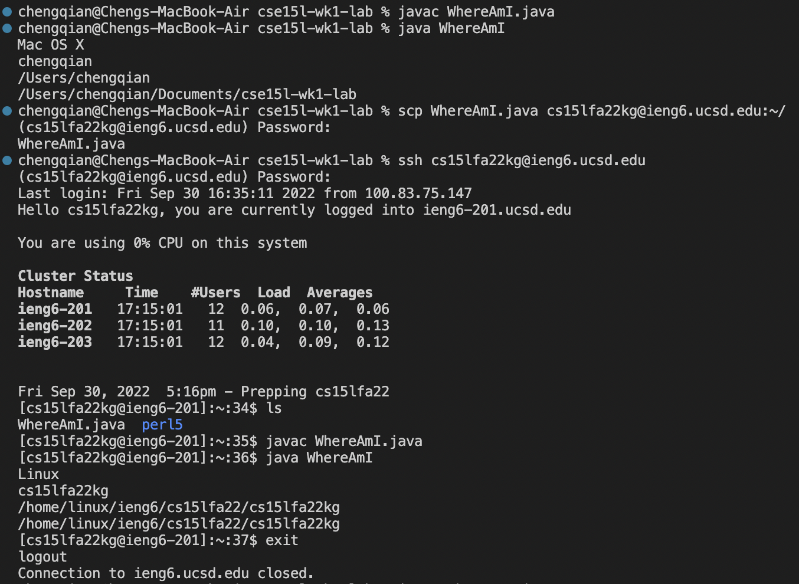
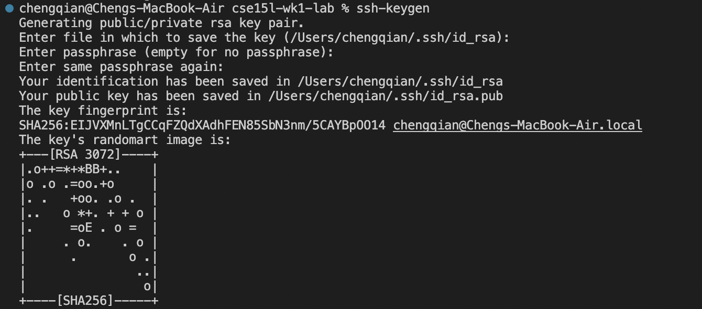
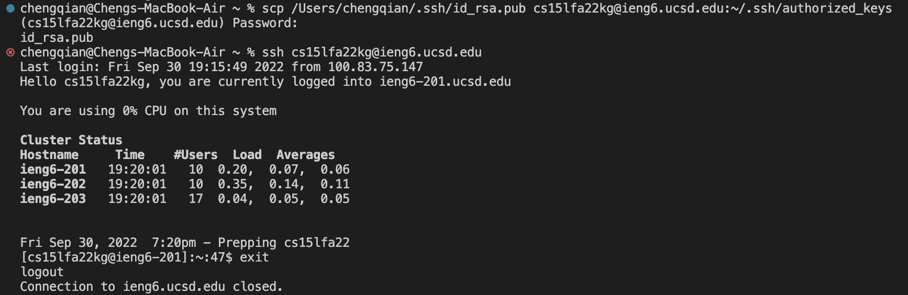
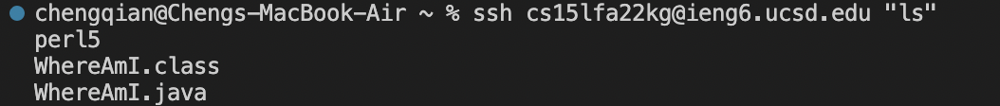
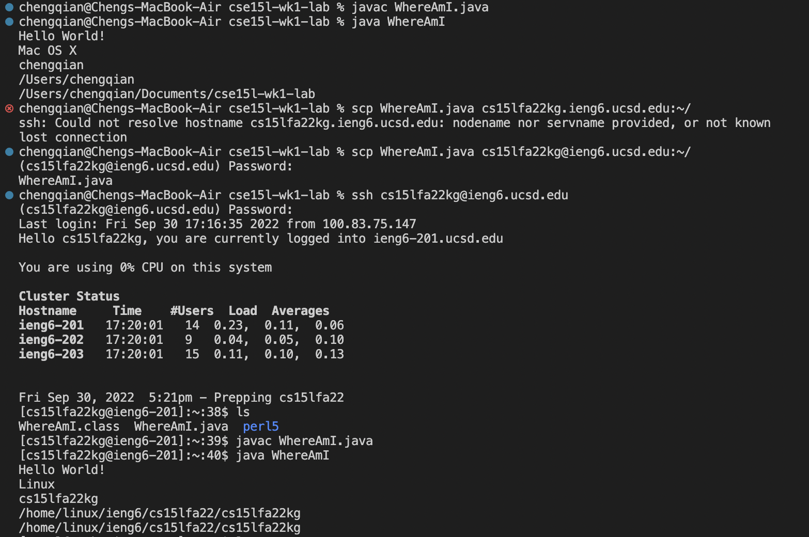

# Week 1 Lab Report


**Installing VScode**

Go to this [website](https://code.visualstudio.com/) to download Visual Studio Code. Select all the default options when downloading it. And after the initial download, one should be able to see the page as shown in the screenshot above.



**Remotely Connecting**

In this section, we learn how to use VS Code to connect to a remote computer to do work there. Use the following command to connect to remote:

`$ ssh cs15lfa22zz@ieng6.ucsd.edu`

After confirming with yes to the prompt and entering the correct password, one will be switching to the terminal on the server. Also, one will be greeted with a welcome messsage and will able to see a summary of the current status of the remote servers.



**Trying Some Commands**

In this section, I tried several different commands. I used the ls command to see the list of files and direcotries, used cd to change into different directories, and used mkdir and rm to create and delete new directories.



**Moving Files with scp**

In this section, we introduce the scp command. To use this command, we should always make sure we are actually on our local machine. By using the scp command, we are able to copy a given file or directory to the remote server. Aftering a successful scp, we will still be on our local machine.
In the above screenshot, I copied over the java file to the remote and tried running it on the remote computer, and indeed the program was suggesting that the program was running on Linux and user name was cs15lfa22kg. 

`scp WhereAmI.java cs15lfa22zz@ieng6.ucsd.edu:~/`

By using the above command, I was able to copy the java file to the home directory on the remote server.




**Setting an SSH Key**

In this section, we use `ssh-keygen` command to generate a pair of private and public ssh keys in order to be able to ssh or scp without needing to enter in our password every time. A private key and public key will be generated and saved to the local computer in a folder called `.ssh` and the private key is in a file called `id_rsa` while the public key is ina file called `id_rsa.pub` We should copy the public key to the remote in a new directory called `.ssh` . On the remote, do the following:
```
$ mkdir .ssh
$ <logout>
```
Then back on the local computer, do the following:
```
$ scp /Users/joe/.ssh/id_rsa.pub cs15lfa22@ieng6.ucsd.edu:~/.ssh/authorized_keys
# You use your username and the path you saw in the command above
```




**Optimizing remote running**

By using the following command, I was able to use the ls command to see all my files stored on the remote server without the explicit step of logging into the remote server.
```
$ ssh cs15lfa22@ieng6.ucsd.edu "ls"
```

