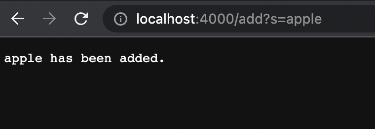
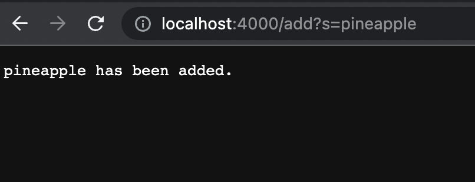
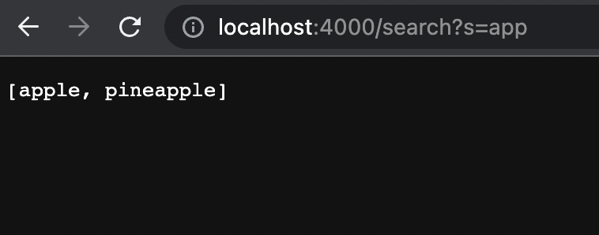
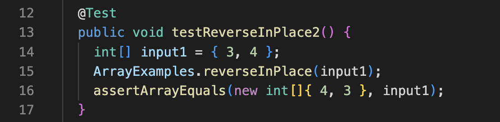
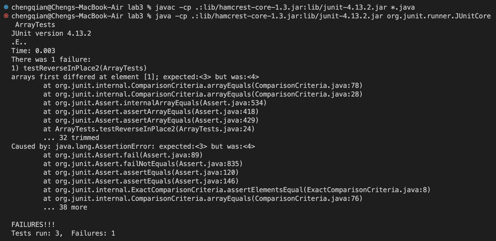
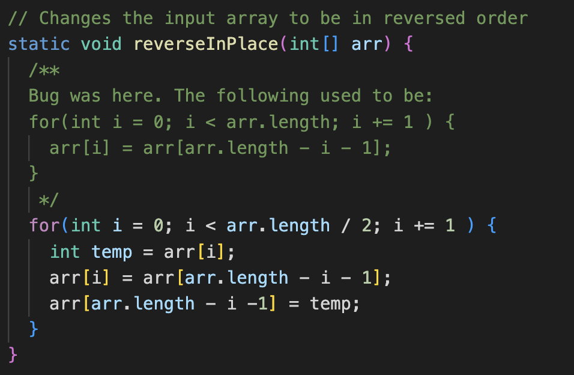
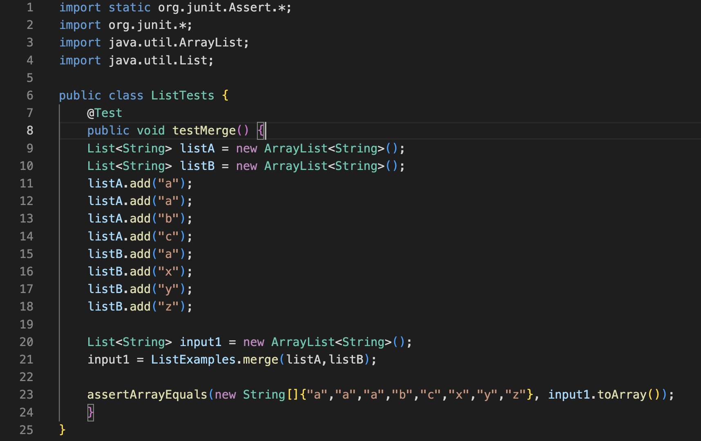
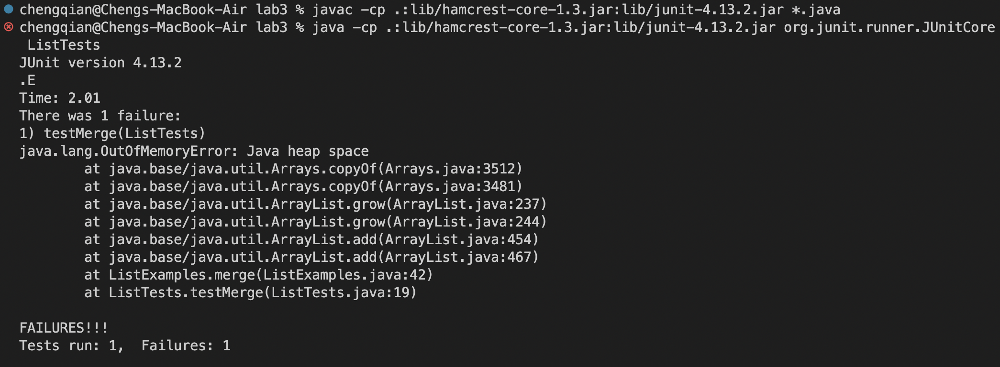
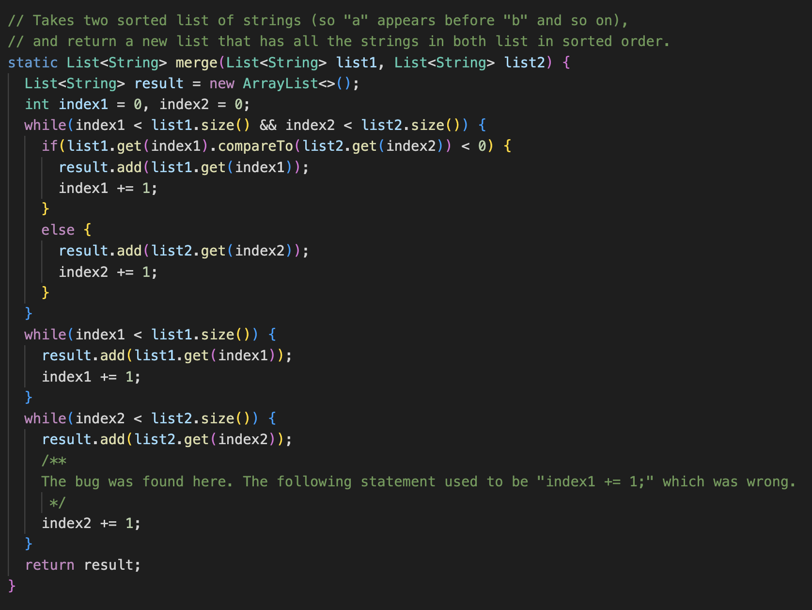

# Week 3 Lab Report
## Part 1
`SearchEngine.java`
```
import java.io.IOException;
import java.net.URI;
import java.util.*;

class Handler implements URLHandler {
    ArrayList<String> list = new ArrayList<String> ();

    public String handleRequest(URI url) {
        if (url.getPath().equals("/")) {
            return String.format("%s", list.toString());
        }
        else if (url.getPath().contains("/search")) {
            String[] param = url.getQuery().split("=");
            if (param.length >= 2 && param[0].equals("s")) {
                ArrayList<String> output = new ArrayList<String> ();
                for (String str : list) {
                    if (str.contains(param[1])) {
                        output.add(str);
                    }
                }
                return String.format("%s", output.toString());
            }
        }
        if (url.getPath().contains("/add")) {
            String[] param = url.getQuery().split("=");
            if(param.length >= 2 && param[0].equals("s")) {
                list.add(param[1]);
                return String.format("%s has been added.", param[1]);
            }
        }
        return "404 Not Found!";
    }
}

class SearchEngine {
    public static void main(String[] args) throws IOException {
        if(args.length == 0){
            System.out.println("Missing port number! Try any number between 1024 to 49151");
            return;
        }

        int port = Integer.parseInt(args[0]);

        Server.start(port, new Handler());
    }
}
```

`Screenshot of using add`


`Screenshot of using add`


`Screenshot of using query`



## Part 2
### Bug #1
* The failure-inducing input (the code of the test)

* The symptom (the failing test output)

* The bug (the code fix needed)

* Then, explain the connection between the symptom and the bug. Why does the bug cause that particular symptom for that particular input?
`The bug was that the original code failed to save the replaced value.`

### Bug #2
* The failure-inducing input (the code of the test)

* The symptom (the failing test output)

* The bug (the code fix needed)

* Then, explain the connection between the symptom and the bug. Why does the bug cause that particular symptom for that particular input?
`The bug was that the original code was updating the wrong variable.`