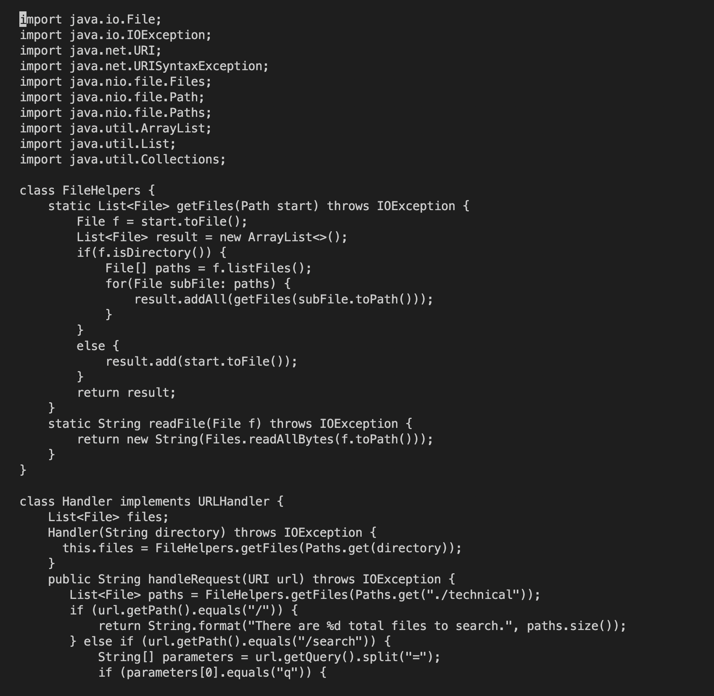
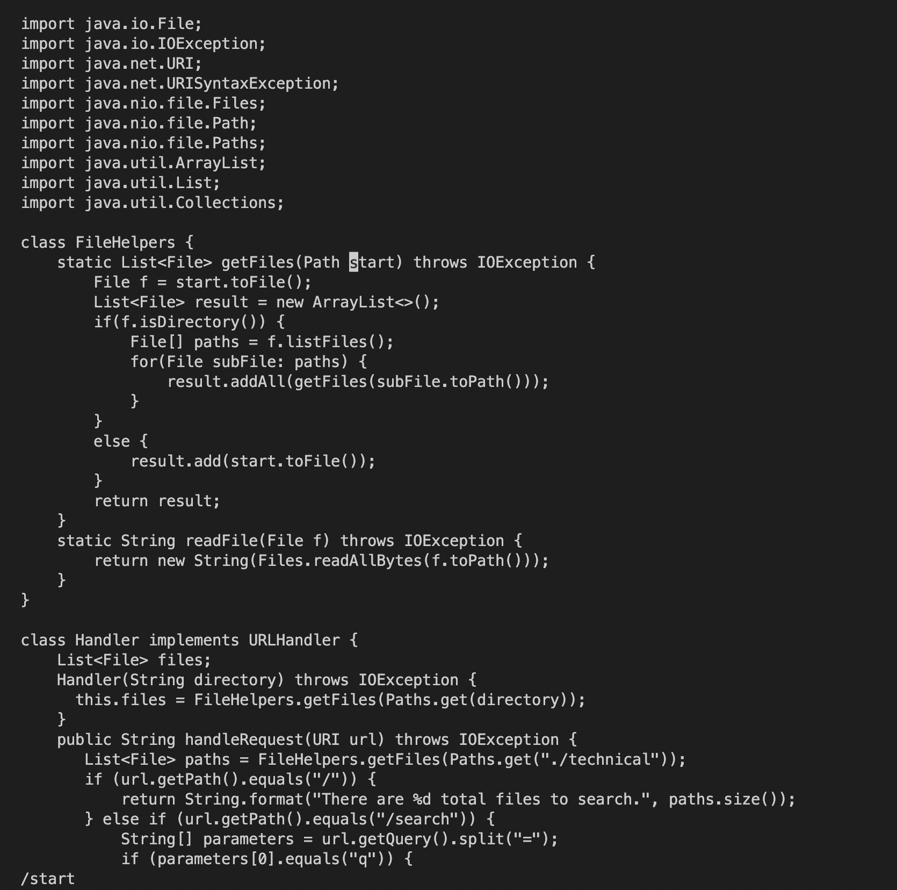
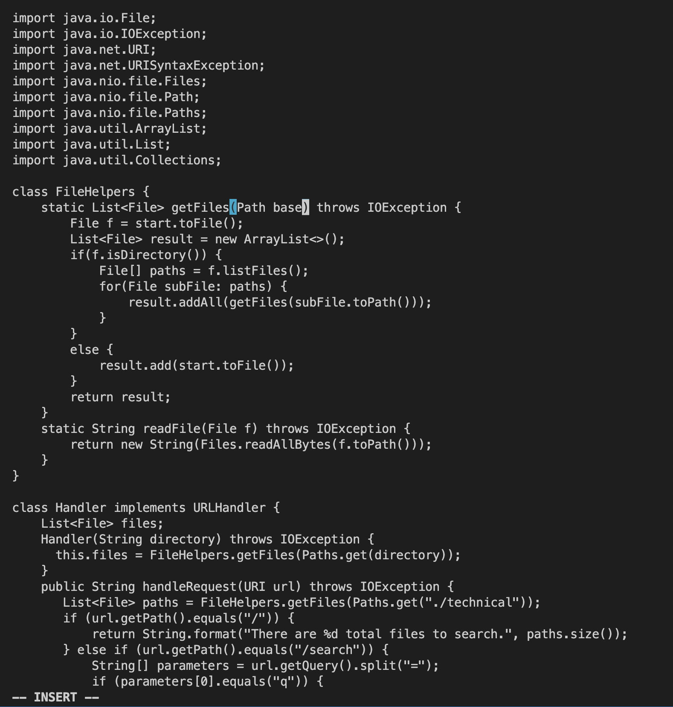
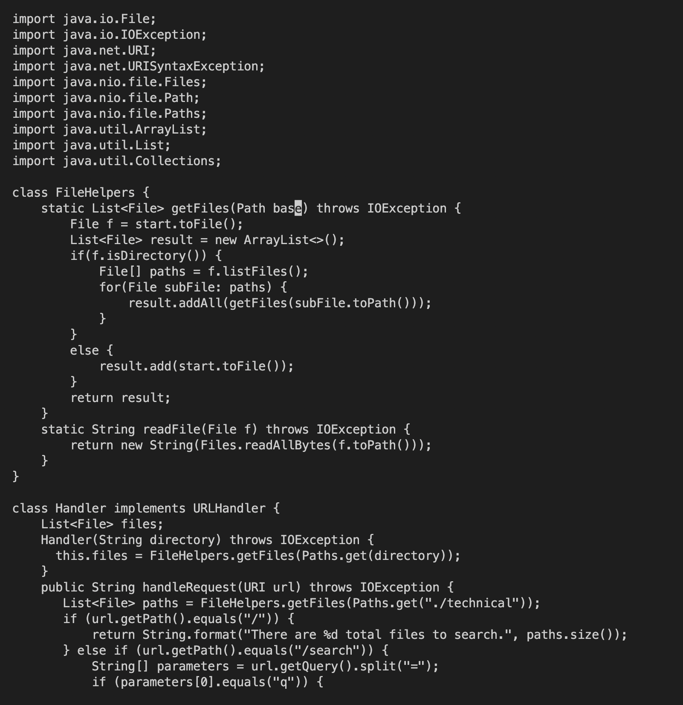
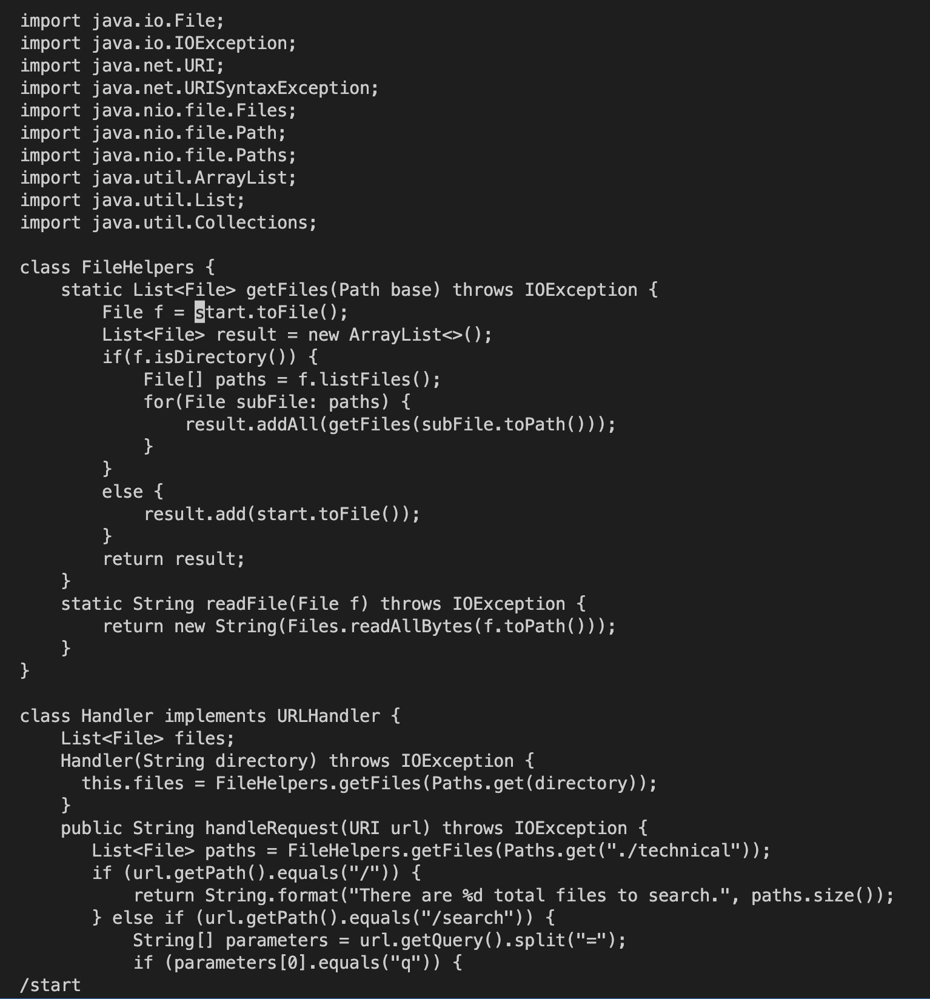
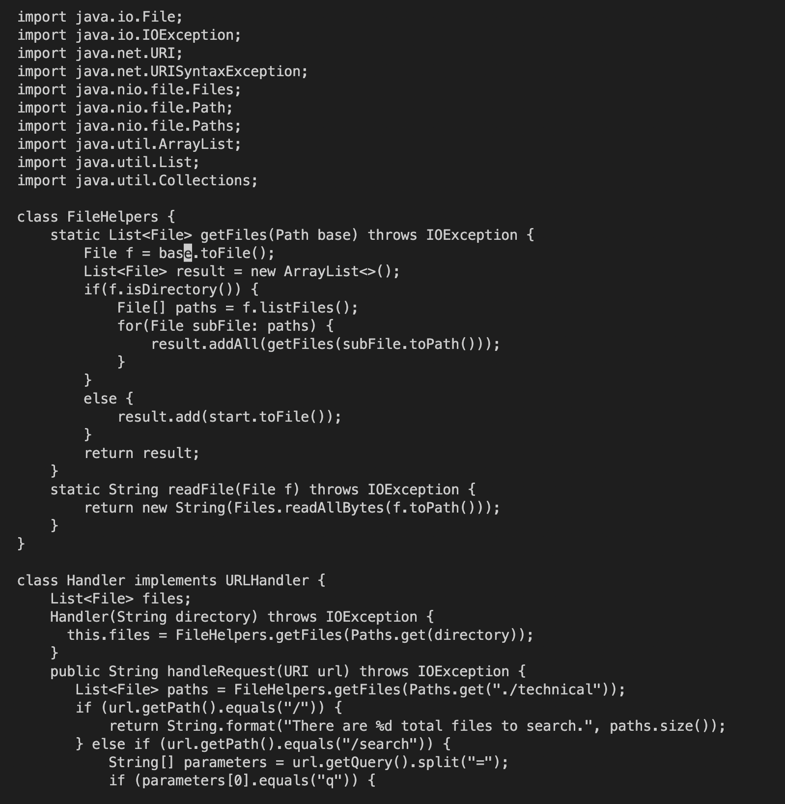
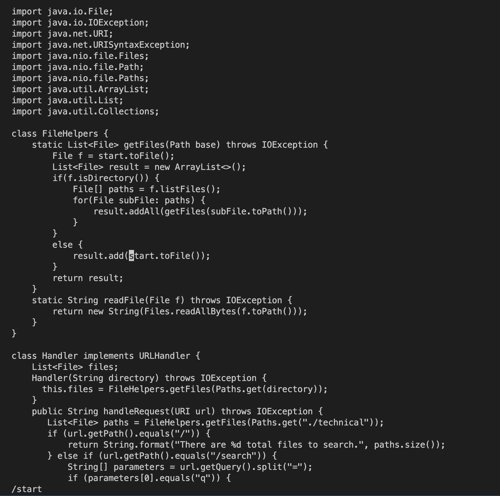
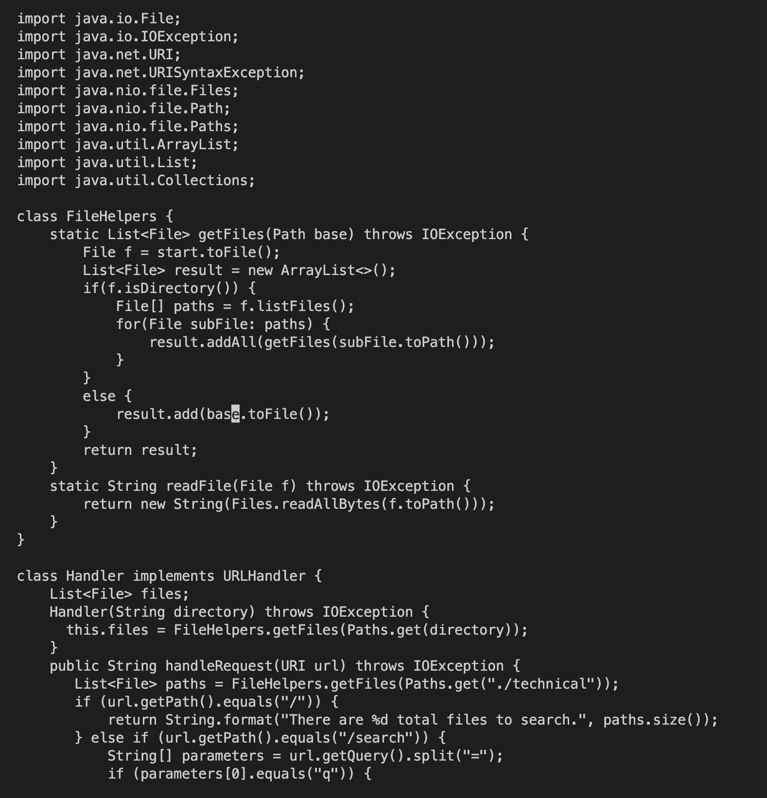
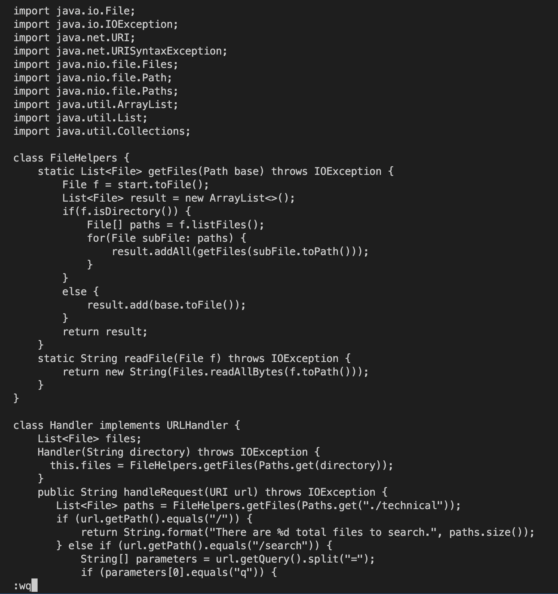

# Week 7 Lab Report


## Changing the name of the start parameter and its uses to base


### Part 1

```
/start -> <Enter> -> ce -> base -> <Esc> -> n -> . -> n -> . -> :wq -> <Enter>
```


This is the start up view of Vim.


We entered in "/start" and pressed enter.


We entered in "ce", which changes to the end of the word.


We entered in "base", which adds the text "base" to where the cursor was.


After entering "Esc", we entered in "n".


We then entered in ".", which changes "start" to "base".


We entered in "n", which jumps the cursor to the next occurence.


We entered in ".", which changes "start" to "base".


We entered in ":wq", which exits out Vim with all changes saved.


### Part 2
---
Q: Consider performing the edit task you chose and re-running the program when you have to run it remotely. Time yourself twice:

* Once, start in Visual Studio Code and make the edit there, then scp the file to the remote server and run it there to confirm it works (you can just run bash test.sh on the remote to test it out). Consider having the appropriate scp command in your command history or easily copy-pasteable!
* Second, start already logged into a ssh session. Then, make the edit for the task you chose in Vim, then exit Vim and run bash test.sh.

Report how long it took you to make the edit in seconds in both styles, and any difficulties or details that came up in doing so.

A: It took me about 110 seconds in both cases. In the first case, the main thing that slows me down a bit was typing in the server address during scp and ssh. In the second case, however, the thing that took me time was using vim as I needed to make sure I type in the corect sequence of vim commands. 

---
Q: Which of these two styles would you prefer using if you had to work on a program that you were running remotely, and why?

A: I would want to just use Vim to edit the code on the remote server if it's a small change and ultimately I want the code change to be reflected on the remote server.

Q: What about the project or task might factor into your decision one way or another? (If nothing would affect your decision, say so and why!)

A: If I have a ton of code and files to edit, I would want to use a code editor like VS Code.