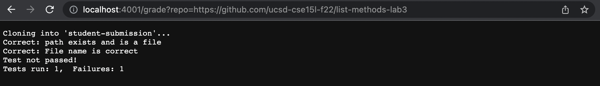
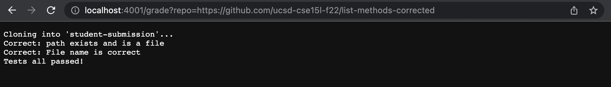
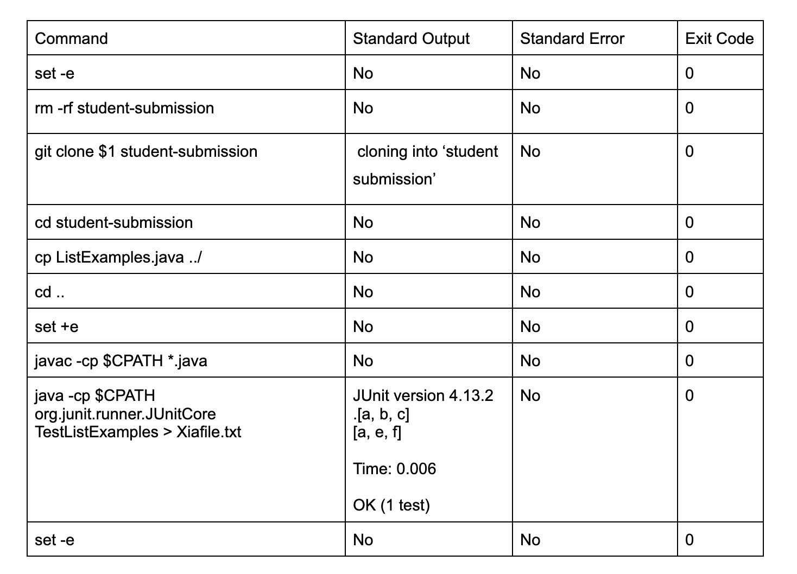

# Week 8 Lab Report

*Our grade.sh*

```
# Create your grading script here

set -e

FILENAME="ListExamples.java"
CPATH=".:lib/hamcrest-core-1.3.jar:lib/junit-4.13.2.jar"

rm -rf student-submission
git clone $1 student-submission

cd student-submission

if [[ -f $FILENAME ]]
then
  echo "Correct: path exists and is a file"
fi

if [[ -e $FILENAME ]]
then
  echo "Correct: File name is correct"
else
  echo "Error! cannot find this file"
exit
fi

cp ListExamples.java ../
cd ..

set +e


javac -cp $CPATH *.java
java -cp $CPATH org.junit.runner.JUnitCore TestListExamples > Xiafile.txt

if [[ $? -eq 0 ]]
then 
    echo "Tests all passed!"
else
    echo "Test not passed!"
    grep "Tests run" Xiafile.txt 
fi

set -e
```


*Screenshots of three different student submissions and their reported grade as loaded in the browser*


Example#1 using https://github.com/ucsd-cse15l-f22/list-methods-lab3, which has the same code as the starter from lab 3



Example#2 using https://github.com/ucsd-cse15l-f22/list-methods-corrected, which has the methods corrected (I would expect this to get full or near-to-full credit)



Example#3 using https://github.com/ucsd-cse15l-f22/list-methods-filename, which has a great implementation saved in a file with the wrong name.


*Now tracing based on example#2*


```
if [[ -f $FILENAME ]]
then
  echo "Correct: path exists and is a file"
fi
```
This condition was true in this example, because the path was correct and there was a correct file in it. As a result, the echo command here was able to run. Its standard error had nothing printed out and the exit code was 0. Its standard output was the string “Correct: path exists and is a file”

---
```
if [[ -e $FILENAME ]]
then
  echo "Correct: File name is correct"
else
  echo "Error! cannot find this file"
exit
fi
```
This condition was true, because the file name was correct. As a result, the first echo command here was able to run. Its standard error had nothing printed out and the exit code was 0. Its standard output was the string “Correct: File name is correct”

---
```
else
  echo "Error! cannot find this file"
exit
```
This command does not run because it is in an if branch that doesn’t evaluate.

---
```
if [[ $? -eq 0 ]]
then 
    echo "Tests all passed!"
else
    echo "Test not passed!"
    grep "Tests run" Xiafile.txt 
fi
```
This condition was true, because the last command ran successfully with an exit code of 0 which leads to the if-condition here being evaluated to true. As a result, the first echo command here was able to run. Its standard error had nothing printed out and the exit code was 0. Its standard output was the string “Test all passed!”

---
```
else
    echo "Test not passed!"
    grep "Tests run" Xiafile.txt 
fi
```
This command was skipped because it is in an if branch that doesn’t evaluate.